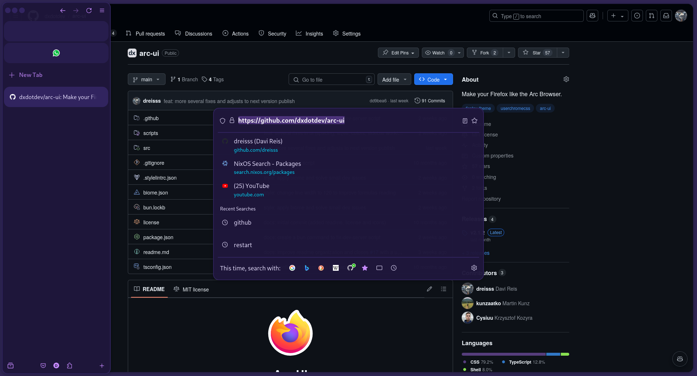

[userChrome.css]: https://www.userchrome.org/
[Arc Browser]: https://arc.net/
[install the userChrome.css manually]: https://www.reddit.com/r/FirefoxCSS/wiki/index/tutorials/#wiki_create_the_folder_and_its_files
[latest release]: https://github.com/dxdotdev/arc-ui/releases/latest

<div align="center">
  

  <h1>Arc UI</h1>
  <p>Make your Firefox like the Arc Browser</p>
</div>

<div align="center">
  <a href="#install">Install</a> • <a href="#features">Features</a> • <a href="#contributing">Contributing</a>
</div>

<br />

Arc UI is a custom [userChrome.css] packed with styles to make your browser look and feel like [Arc Browser].



<br />

## Install

To install the userChrome.css, close Firefox and follow the steps below:

<details>
  <summary>Linux</summary>

Just run the command:

```bash
bash -c "$(curl https://raw.githubusercontent.com/dxdotdev/arc-ui/main/scripts/install.sh)"
```

And restart your Firefox.

</details>

<details>
  <summary>Windows</summary>

You can [install the userChrome.css manually] in windows (auto install script in development).

The Arc UI userChrome.css can be found and downloaded in the [latest release].

</details>

## Uninstall

To uninstall the userChrome.css follow the instructions:

<details>
  <summary>Linux</summary>

Just run the command:

```bash
bash -c "$(curl https://raw.githubusercontent.com/dxdotdev/arc-ui/main/scripts/uninstall.sh)"
```

And restart your Firefox.

</details>

<details>
  <summary>Windows</summary>

Delete the userChrome.css file specified in the windows manual [installation](#install) guide.

</details>

## Contributing

See [Contributing Guide](./.github/CONTRIBUTING.md).
